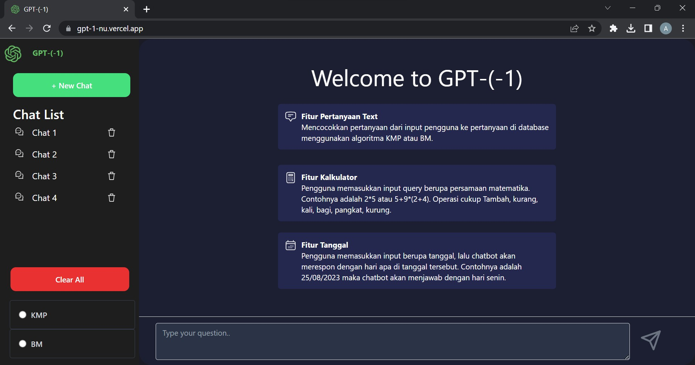

# Tubes3_13521100
Tubes 3 String Matching dan Regular Expression - IF2211 Strategi Algoritma

## **Table of Contents**
* [General Information](#general-information)
* [Requirements](#requirements)
* [How to Run and Compile](#how-to-run-and-compile)
* [Screenshot](#screenshot)
* [Features](#features)
* [Authors](#authors)

## **General Information**
>Web-based application simple ChatGPT by applying the simplest QA approach. The search for the most similar question to the question given by the user is done using the Knuth-Morris-Pratt (KMP) and Boyer-Moore (BM) string matching algorithms. Regex is used to determine the format of the question. If there is no exact match between the user's question and the questions in the database through the KMP or BM algorithms, then the chatbot will use the most similar question with at least 90% similarity. If there is no question with a similarity above 90%, then the chatbot will provide a maximum of 3 options for the most similar questions to be selected by the user. This application use NextJs as fullstack framework

## **Requirements**
To use this program, you will need to install **npm**. 
Change the directory to the 'gpt-1' folder <br>
```sh 
$ cd gpt-1
```
then install npm
```sh
$ npm install
```
| Aspect    | Required Program | Reference Link                            |
|-----------|------------------|-------------------------------------------|
| Backend   | NextJS           | [NextJS](https://nextjs.org/)             |
|           | Prisma           | [Prisma](https://www.prisma.io/)          |
|           | PostgreSQL       | [PostgreSQL](https://www.postgresql.org/) |
| Frontend  | NextJS           | [NextJS](https://nextjs.org/)             |
|           | Tailwind         | [Tailwind](https://tailwindcss.com/)      |

## **How to Run and Compile**
### **Setup**
1. Clone this repository <br>
```sh 
$ git clone https://github.com/AJason36/Tubes3_13521100
```
2. Open this repository in terminal
### **Run (Local Host)**
1. Change the directory to the 'gpt-1' folder <br>
```sh 
$ cd gpt-1
```

2. Run the development server:
```bash
npm run dev
# or
yarn dev
# or
pnpm dev
```

3. Open [http://localhost:3000](http://localhost:3000) with your browser to see the result.

### **Run (Server)**
1. Open [https://gpt-1-nu.vercel.app/](https://gpt-1-nu.vercel.app/)

## **Screenshot**

1. Main Page
 


## **Features**
| Features                                               |
|--------------------------------------------------------|
| Adding questions and answers to database               |
| Removing questions and answers to database             |
| Mathematical calculation queries                       |
| Date-related queries                                   |
| Queries with multiple questions and multiple answers	 |

## **Authors**

| **NIM**  |       **Name**        | **Class**  |       
| :------: | :-------------------: | :------:   | 
| 13521100 |    Alexander Jason    | K02
| 13521114 |  Farhan Nabil Suryono | K02
| 13521137 |      Michael Utama    | K02